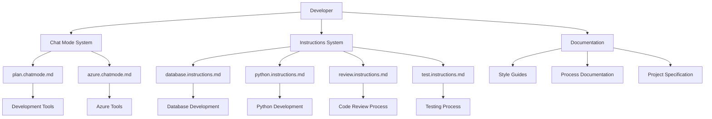
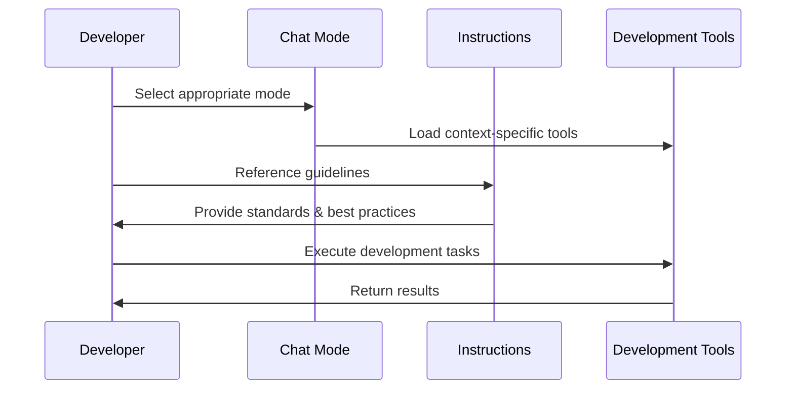
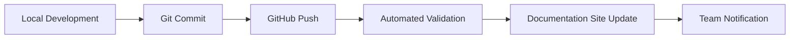

# Project Specification

## 📋 프로젝트 개요

### 프로젝트명
**Hanni Development Framework**

### 버전
1.0.0

### 목적
새로운 기능 구현과 기존 코드 리팩토링을 체계적으로 관리하기 위한 개발 프레임워크 구축

### 범위
- Chat Mode 시스템을 통한 컨텍스트 기반 개발 환경 제공
- Instructions 시스템을 통한 표준화된 개발 가이드라인 제공
- 문서화 표준 및 품질 보증 프로세스 정의

## 🎯 비즈니스 요구사항

### 1. 핵심 기능 요구사항

#### Chat Mode 시스템
- **요구사항 ID**: REQ-001
- **설명**: 작업 컨텍스트에 맞는 특화된 개발 모드 제공
- **우선순위**: High
- **구현 상태**: ✅ 완료

**기능 명세:**
```yaml
Chat Modes:
  - plan.chatmode.md:
      description: "새로운 기능 구현 또는 리팩토링 계획 수립"
      tools: ['codebase', 'fetch', 'search', 'usages', 'githubRepo']
      
  - azure.chatmode.md:
      description: "Azure 클라우드 서비스 관련 작업 전용"
      tools: ['codebase', 'fetch', 'search', 'usages', 'githubRepo']
```

#### Instructions 시스템
- **요구사항 ID**: REQ-002
- **설명**: 개발 영역별 표준화된 가이드라인 제공
- **우선순위**: High
- **구현 상태**: ✅ 완료

**기능 명세:**
```yaml
Instructions:
  - database.instructions.md: "데이터베이스 설계, 개발, 운영 가이드"
  - python.instructions.md: "Python 코딩 스타일 및 모범 사례"
  - review.instructions.md: "코드 리뷰 프로세스 및 체크리스트"
  - test.instructions.md: "테스트 작성 및 품질 보증 가이드"
```

### 2. 비기능 요구사항

#### 사용성 (Usability)
- **요구사항 ID**: NFR-001
- **설명**: 직관적이고 접근하기 쉬운 문서 구조
- **측정 기준**: 새로운 팀원이 30분 내에 가이드를 이해하고 적용 가능

#### 확장성 (Extensibility)
- **요구사항 ID**: NFR-002
- **설명**: 새로운 Chat Mode 및 Instructions 추가 용이성
- **측정 기준**: 새로운 모드/가이드 추가 시 기존 구조 변경 불필요

#### 일관성 (Consistency)
- **요구사항 ID**: NFR-003
- **설명**: 모든 문서 간 일관된 형식 및 스타일 유지
- **측정 기준**: 문서 스타일 가이드 100% 준수

## 🏗️ 시스템 아키텍처

### 1. 전체 시스템 구조
```
hanni-project/
├── .github/
│   ├── chatmodes/           # Chat Mode 정의
│   │   ├── plan.chatmode.md
│   │   ├── azure.chatmode.md
│   │   └── README.md
│   └── instructions/        # 개발 가이드라인
│       ├── database.instructions.md
│       ├── python.instructions.md
│       ├── review.instructions.md
│       ├── test.instructions.md
│       └── README.md
├── docs/                    # 상세 문서화
│   ├── database-style.md
│   ├── python-style.md
│   ├── review-instructions.md
│   ├── test-style.md
│   ├── spec.md
│   └── README.md
├── .gitignore
└── README.md
```

### 2. 컴포넌트 다이어그램


### 3. 데이터 흐름


## 🔧 기술 명세

### 1. 파일 형식 표준
- **Markdown**: 모든 문서는 `.md` 형식
- **YAML Front Matter**: Chat Mode 설정용
- **Mermaid**: 다이어그램 및 플로우차트

### 2. Chat Mode 파일 구조
```yaml
---
description: "모드에 대한 간단한 설명"
tools: ['tool1', 'tool2', 'tool3']
---
# Mode Name
모드별 상세 지침 내용...
```

### 3. Instructions 파일 구조
```markdown
# Instruction Title

## 🎯 핵심 원칙
- 원칙 1
- 원칙 2

## 📝 가이드라인
### 1. 카테고리 1
내용...

### 2. 카테고리 2
내용...

## 🛠️ 도구 및 기술
추천 도구 및 기술 스택

---
마무리 메시지
```

## 📊 품질 기준

### 1. 코드 품질 메트릭
- **문서화 커버리지**: 모든 기능에 대한 설명 문서 존재
- **일관성 점수**: 스타일 가이드 준수율 95% 이상
- **접근성**: 새 팀원의 이해도 테스트 통과

### 2. 성능 기준
- **로딩 시간**: 문서 접근 시간 < 2초
- **검색 효율성**: 특정 가이드라인 찾기 < 30초
- **업데이트 반영**: 변경사항 적용 < 1분

### 3. 보안 요구사항
- **접근 제어**: GitHub 저장소 권한 기반 접근 관리
- **버전 관리**: 모든 변경사항에 대한 추적 가능성
- **백업**: 정기적인 저장소 백업 및 복구 계획

## 🧪 테스트 전략

### 1. 문서 유효성 테스트
```yaml
Test Categories:
  - Markdown Syntax Validation
  - Link Integrity Check
  - YAML Front Matter Validation
  - Code Block Syntax Verification
```

### 2. 사용성 테스트
```yaml
Test Scenarios:
  - New Developer Onboarding Test
  - Guide Application Test
  - Documentation Search Test
  - Cross-Reference Validation Test
```

### 3. 통합 테스트
```yaml
Integration Points:
  - GitHub Repository Integration
  - Development Tool Integration
  - CI/CD Pipeline Integration
  - Documentation Site Integration
```

## 🚀 배포 및 운영

### 1. 배포 프로세스


### 2. 모니터링 계획
- **사용량 추적**: 문서 접근 빈도 및 패턴 분석
- **피드백 수집**: 정기적인 팀 피드백 및 개선 제안
- **품질 메트릭**: 월간 품질 보고서 생성

### 3. 유지보수 계획
- **정기 업데이트**: 분기별 내용 검토 및 업데이트
- **기술 스택 갱신**: 새로운 도구 및 기술 반영
- **사용자 요청**: 팀원 요청사항 반영

## 📈 성공 지표

### 1. 정량적 지표
- **사용률**: 월간 활성 사용자 수 > 팀원의 90%
- **만족도**: 분기별 만족도 조사 > 4.0/5.0
- **효율성**: 개발 시간 단축 > 20%

### 2. 정성적 지표
- **코드 품질 향상**: 리뷰 시간 단축 및 버그 감소
- **팀 협업 개선**: 표준화된 프로세스 정착
- **지식 공유 활성화**: 팀 내 기술 전파 증가

## 🔄 향후 로드맵

### Phase 4: 고도화 (Q1 2025)
- [ ] 인터랙티브 문서 기능 추가
- [ ] AI 기반 가이드 추천 시스템
- [ ] 다국어 지원 (영어, 일본어)

### Phase 5: 확장 (Q2 2025)
- [ ] 다른 프로젝트로의 확장 적용
- [ ] 커뮤니티 기여 가이드 추가
- [ ] 오픈소스 템플릿 제공

### Phase 6: 최적화 (Q3 2025)
- [ ] 성능 최적화 및 경량화
- [ ] 사용자 맞춤형 추천 기능
- [ ] 고급 분석 및 리포팅 기능

---

## 📞 연락처 및 지원

### 프로젝트 팀
- **프로젝트 오너**: Hanni Kim
- **저장소**: https://github.com/Hanni-Kim/hanni
- **이슈 트래킹**: GitHub Issues
- **문의**: GitHub Discussions

### 기여 방법
1. 이슈 생성을 통한 문제 보고
2. Pull Request를 통한 개선 제안
3. Discussions를 통한 아이디어 공유
4. Wiki를 통한 추가 문서 기여

---

*이 명세서는 프로젝트의 성장과 함께 지속적으로 업데이트됩니다.*