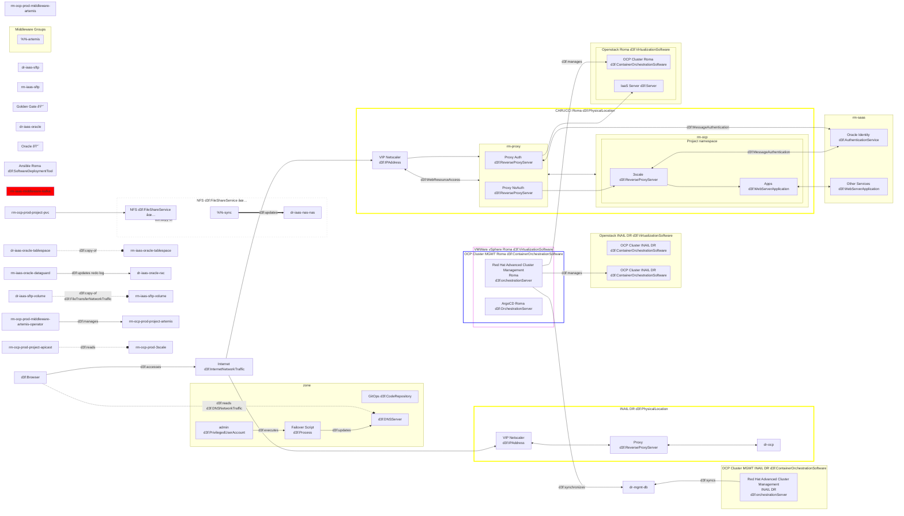

# Diagram

```mermaid
graph LR

classDef physical fill:none,stroke:yellow,stroke-width:4px;
classDef container fill:none,stroke:blue,stroke-width:2px;
classDef virtual fill:none,stroke:violet,stroke-width:2px;
classDef standby fill:none,stroke:lightgray,stroke-width:1px, stroke-dasharray: 5, 5;
classDef error fill:red

classDef namespace fill:none,stroke:green,stroke-width:1px, stroke-dasharray: 5, 5;

subgraph rm[CARUCCI Roma d3f:PhysicalLocation]
    %%-iaas
    %%-vsphere
end

subgraph rm-vsphere[VMWare vSphere Roma d3f:VirtualizationSoftware]
rm-ocp-mgmt
end

class rm-vsphere virtual
class rm-iaas virtual


subgraph rm-iaas[Openstack Roma d3f:VirtualizationSoftware]
rm-ocp-prod
rm-ocp-prod
%%-middleware-kafka
end

subgraph rm-iaas-middleware-kafka
%%-ps["Red Hat AMQ Roma d3f:Database"]
%%-operator["Red Hat AMQ Operator Roma d3f:ContainerOrchestrationSoftware"]
%%-operator -->|d3f:manages| %%-ps
end

class rm-iaas-middleware-kafka error

subgraph rm-ocp-mgmt[OCP Cluster MGMT Roma d3f:ContainerOrchestrationSoftware]
rm-rhacm["Red Hat Advanced Cluster Management\n Roma d3f:orchestrationServer"]
rm-argocd["ArgoCD Roma d3f:OrchestrationServer"]
end


subgraph rm-ocp-prod[OCP Cluster Roma d3f:ContainerOrchestrationSoftware]
%%-middleware
%%-project
end


subgraph rm-ocp-prod-middleware[Middleware Groups]
    subgraph %%-artemis
    %%-ps["Red Hat ActiveMQArtemis d3f:Database"]
    %%-operator["Red Hat AMQ Operator Roma d3f:ContainerOrchestrationSoftware"]
    %%-operator -->|d3f:manages| %%-ps
    end
end

subgraph rm-ocp-prod-project[Project namespace]
end


subgraph rm-ocp-prod[OCP Cluster Roma d3f:ContainerOrchestrationSoftware]
end

subgraph rm-ansible[Ansible Roma d3f:SoftwareDeploymentTool]
end


%% Datacenter INAIL DR

subgraph dr[INAIL DR d3f:PhysicalLocation]
%%-iaas
%%-mgmt-db[(MGMT DB d3f:Database)]
%%-ocp-mgmt
end

subgraph dr-iaas[Openstack INAIL DR d3f:VirtualizationSoftware]
dr-ocp-prod
dr-ocp-coll
end

subgraph dr-ocp-prod[OCP Cluster INAIL DR d3f:ContainerOrchestrationSoftware]
end
subgraph dr-ocp-mgmt[OCP Cluster MGMT INAIL DR d3f:ContainerOrchestrationSoftware]
dr-rhacm["Red Hat Advanced Cluster Management\n INAIL DR d3f:orchestrationServer"]
end
subgraph dr-ocp-coll[OCP Cluster INAIL DR d3f:ContainerOrchestrationSoftware]
end

rm-rhacm -->|d3f:manages| rm-ocp-prod & dr-ocp-prod

rm-rhacm -->|d3f:synchronizes| dr-mgmt-db 
dr-mgmt-db ~~~ dr-rhacm -->|d3f:syncs| dr-mgmt-db


%% formatting
rm ~~~ dr

class rm physical
class dr physical
class rm-ocp-prod container,active
class rm-ocp-mgmt container
class dr-ocp-prod container,standby

classDef physical fill:none,stroke:red,stroke-width:4px;
classDef container fill:none,stroke:blue,stroke-width:2px;
classDef standby fill:none,stroke:lightgray,stroke-width:1px, stroke-dasharray: 5, 5;

subgraph rm-iaas
%%-oracle
%%-oracle-goldengate
%%-mongodb[MongoDB d3f:Database]
%%-powercenter
%%-nas
%%-sftp
%%-solr
%%-ecs
end

subgraph dr-iaas
%%-oracle
%%-oracle-goldengate
%%-mongodb[MongoDB d3f:Database]
%%-powercenter
%%-nas
%%-sftp
%%-solr
%%-ecs
end

dr-iaas-oracle-tablespace -.-o|d3f:copy-of| rm-iaas-oracle-tablespace

subgraph dr-iaas
%%-oracle
end

subgraph rm-iaas-oracle["Oracle 🔴"]
%%-rac["🔴Oracle RAC d3f:Database"]
%%-dataguard["🔴Dataguard d3f:Process"]
%%-tablespace["🔴tablespace d3f:Volume"]
%%-backup["🔴Backup d3f:RestoreDatabase"]
%%-vip["VIP d3f:IPAddress"]

%%-tablespace ~~~ %%-goldengate --o %%-tablespace 
%%-goldengate -->|d3f:updates\nChange Data CaputreDatabase| %%-tablespace 
%%-vip -.- %%-dataguard
end

subgraph dr-iaas-oracle
%%-vip["VIP d3f:IPAddress"]
%%-rac["Oracle RAC d3f:Database"]
%%-dataguard["Dataguard d3f:Process"]
%%-tablespace["tablespace d3f:Volume"]
%%-backup["Backup d3f:RestoreDatabase"]
%%-vip -.- %%-dataguard
end

rm-iaas-oracle-dataguard -->|d3f:updates redo log| dr-iaas-oracle-rac


subgraph rm-iaas-oracle-goldengate["Golden Gate 🔴"]
%%-server["Goldengate Server d3f:Process"]
end


class rm-iaas-oracle-rac active
class dr-iaas standby
classDef standby fill:none,stroke:lightgray,stroke-width:1px, stroke-dasharray: 5, 5;

subgraph rm
%%-oracle
%%-iaas
%%-ocp-coll-middleware-amq -->|d3f:DigitalEventRecord| %%-iaas-nas
end

dr ~~~ rm
subgraph rm-iaas
%%-nas
%%-power-center["PowerCenter d3f:Process"]

%%-power-center --> %%-nas & %%-oracle
end


subgraph rm-iaas-nas["NFS d3f:FileShareService ✅"]
%%-nas["NFS Isilon 130TB d3f:FileShareService"]
end

subgraph dr
direction LR
%%-oracle
%%-iaas
%%-ocp-coll-middleware-amq -->|d3f:DigitalEventRecord| %%-iaas-nas
end


subgraph dr-iaas
%%-nas
%%-power-center["PowerCenter d3f:Process"]

%%-power-center --> %%-nas & %%-oracle

end

subgraph dr-iaas-nas["NFS d3f:FileShareService ✅"]
%%-nas["Filesystem 130TB d3f:Volume"]
%%-server["fa:fa-linux d3f:Server"]
%%-nfs["NFS d3f:FileShareService"]
%%-sync["d3f:ScheduledJob"]
%%-server -->|d3f:executes| %%-sync
%%-server -->|d3f:executes| %%-nfs
%%-sync -.-o|d3f:reads<br>d3f:SSHSession<br>d3f:AdministrativeNetworkTraffic| rm-iaas-nas

rm-iaas-nas ~~~ %%-sync ==>|d3f:updates| dr-iaas-nas-nas
end


dr-iaas-nas -.-o|d3f:copy-of| rm-iaas-nas

class dr-iaas-nas standby

subgraph rm-iaas
%%-sftp
end

subgraph rm-iaas-sftp
%%-sftp["SFTP d3f:FileShareService"]
%%-volume["SFTP Volume d3f:Volume"]

%%-sftp --> %%-volume
end

subgraph dr-iaas-sftp
%%-sftp["SFTP d3f:FileShareService"]
%%-volume["SFTP Volume d3f:Volume"]
%%-sftp --> %%-volume
end

dr-iaas-sftp-volume -.-o|d3f:copy-of<br>d3f:FileTransferNetworkTraffic| rm-iaas-sftp-volume


subgraph rm-iaas
%%-ecs["Dell ECS d3f:CloudStorage"]
end

subgraph dr-iaas
%%-ecs["TO BE DONE"]
end

classDef physical fill:none,stroke:yellow,stroke-width:4px;
classDef container fill:none,stroke:blue,stroke-width:2px;
classDef virtual fill:none,stroke:violet,stroke-width:2px;
classDef standby fill:none,stroke:lightgray,stroke-width:1px, stroke-dasharray: 5, 5;
classDef error fill:red

classDef namespace fill:none,stroke:green,stroke-width:1px, stroke-dasharray: 5, 5;


subgraph rm-ocp-prod[OCP Cluster Roma d3f:ContainerOrchestrationSoftware]
%%-middleware
%%-project
end


subgraph rm-ocp-prod-middleware[Middleware Groups]
%%-artemis
end

subgraph rm-ocp-prod-middleware-artemis
%%-operator["Red Hat AMQ Operator Roma d3f:ContainerOrchestrationSoftware"]
end

rm-ocp-prod-middleware-artemis-operator -->|d3f:manages| rm-ocp-prod-project-artemis

subgraph rm-ocp-prod-project[Project namespace]
%%-apps["Apps d3f:WebServerApplication"]
%%-artemis["Red Hat ActiveMQArtemis queue"]@{shape: "das"}
%%-apicast["Red Hat 3Scale d3f:ReverseProxyServer"]
%%-pvc["PersistentVolumeClaim d3f:Volume"]

%%-apicast --> %%-apps --> %%-artemis --> %%-pvc
end

rm-ocp-prod-project-pvc --> rm-iaas-nas

class rm-ocp-prod-project namespace


classDef physical fill:none,stroke:yellow,stroke-width:4px;
classDef container fill:none,stroke:blue,stroke-width:2px;
classDef virtual fill:none,stroke:violet,stroke-width:2px;
classDef standby fill:none,stroke:lightgray,stroke-width:1px, stroke-dasharray: 5, 5;
classDef error fill:red

classDef namespace fill:none,stroke:green,stroke-width:1px, stroke-dasharray: 5, 5;


subgraph zone
rm-ocp-gitops-git["GitOps d3f:CodeRepository"]
end

subgraph rm-ocp-prod-project
%%-apicast["Apicast d3f:ReverseProxyServer"]
end

rm-ocp-prod-project-apicast -.-o |d3f:reads| rm-ocp-prod-3scale

subgraph rm-ocp-prod
%%-3scale["3scale d3f:ConfigurationResource"]
%%-gitops-operator["GitOps Operator d3f:ContainerOrchestrationSoftware"]


%%-apicast-operator["Apicast Operator d3f:ContainerOrchestrationSoftware"]
%%-3scale-operator["3scale Operator d3f:ContainerOrchestrationSoftware"]

%%-apicast-operator -->|d3f:manages| %%-project-apicast
%%-3scale-operator -->|d3f:manages| %%-3scale


%%-gitops-operator -.-o |d3f:reads| rm-ocp-gitops-git
%%-gitops-operator -->|d3f:manages| %%-apicast-operator & %%-3scale-operator
%%-project
end


class rm-ocp-prod-project namespace


subgraph dr-ocp-coll
%%-apicast["Apicast d3f:ReverseProxyServer"]
%%-3scale["3scale d3f:ConfigurationResource"]
%%-gitops-operator["GitOps Operator d3f:ContainerOrchestrationSoftware"]

%%-apicast -.-o |d3f:reads| %%-3scale

%%-apicast-operator["Apicast Operator d3f:ContainerOrchestrationSoftware"]
%%-3scale-operator["3scale Operator d3f:ContainerOrchestrationSoftware"]

%%-apicast-operator -->|d3f:manages| %%-apicast
%%-3scale-operator -->|d3f:manages| %%-3scale

%%-gitops-operator -.-o |d3f:reads| rm-ocp-gitops-git
%%-gitops-operator -->|d3f:manages| %%-apicast-operator & %%-3scale-operator
end


subgraph zone
admin["admin d3f:PrivilegedUserAccount"]
dns["d3f:DNSServer"]
dns-failover-script -->|d3f:updates| dns
end

u["d3f:Browser"]
web["Internet d3f:InternetNetworkTraffic"]

web ---> rm-vip & dr-vip
admin -->|d3f:executes| dns-failover-script["Failover Script<br>d3f:Process"]
u -.-o|d3f:reads d3f:DNSNetworkTraffic| dns
u --->|d3f:accesses| web


subgraph rm[CARUCCI Roma d3f:PhysicalLocation]
rm-vip["VIP Netscaler\nd3f:IPAddress"]
rm-proxy["Proxy d3f:ReverseProxyServer"]

rm-vip <--> |d3f:WebResourceAccess| rm-proxy
rm-ocp

rm-proxy <--> rm-ocp
end

subgraph dr[INAIL DR d3f:PhysicalLocation]
dr-vip["VIP Netscaler\nd3f:IPAddress"]
dns-failover-script
dr-proxy["Proxy d3f:ReverseProxyServer"]
dr-ocp

dr-vip <--> dr-proxy <--> dr-ocp
end


rm ~~~  zone ~~~ dr

subgraph rm
rm-vip
rm-proxy

rm-vip --> rm-proxy
end

subgraph rm-proxy
rm-proxy-auth["Proxy Auth d3f:ReverseProxyServer"]
rm-proxy-noauth["Proxy NoAuth d3f:ReverseProxyServer"]
end

subgraph rm-ocp
subgraph rm-ocp-prod-project
rm-ocp-prod-project-3scale["3scale d3f:ReverseProxyServer"]
rm-ocp-prod-project-apps["Apps d3f:WebServerApplication"]

rm-ocp-prod-project-3scale --> rm-ocp-prod-project-apps
end
end

subgraph rm-iaas
rm-iaas-server["IaaS Server d3f:Server"]
end

subgraph rm-saas
rm-saas-oauth["Oracle Identity d3f:AuthenticationService"]
rm-saas-other["Other Services d3f:WebServerApplication"]
end

rm-ocp-prod-project-apps <--> rm-saas-other
rm-proxy-auth --> rm-iaas-server
rm-proxy-noauth --> rm-ocp-prod-project-3scale
rm-ocp-prod-project-3scale <--> |d3f:MessageAuthentication| rm-saas-oauth
rm-proxy-auth <--> |d3f:MessageAuthentication| rm-saas-oauth

subgraph rm-cloud-network[ ]
rm-iaas 
rm-ocp
end
```