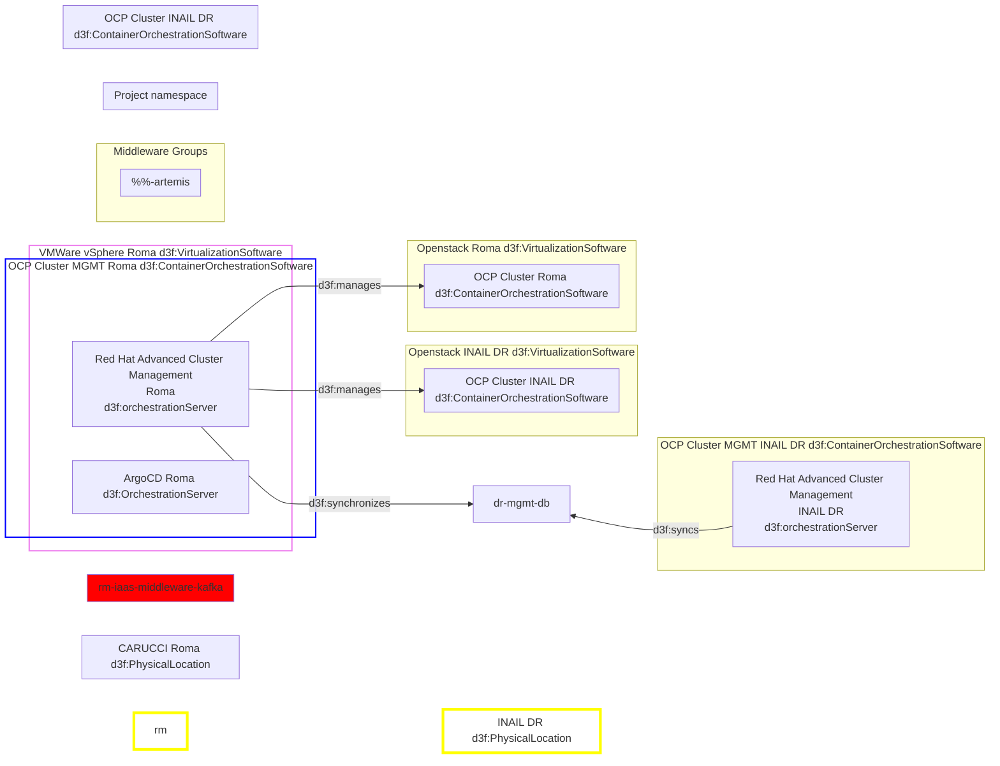
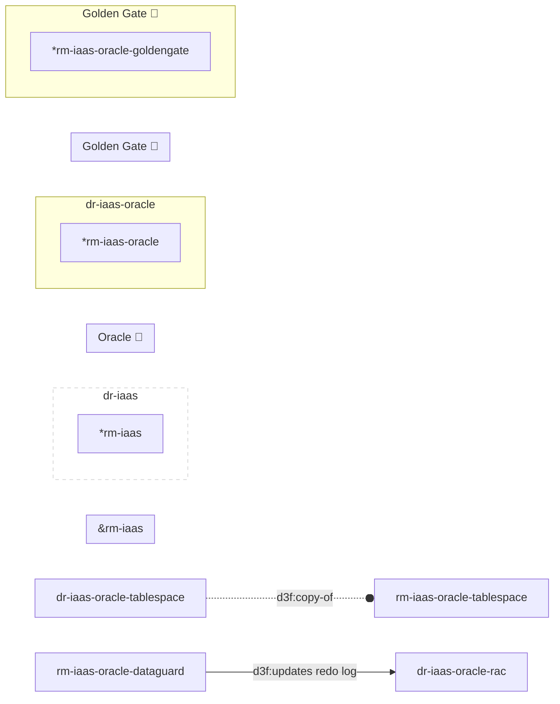
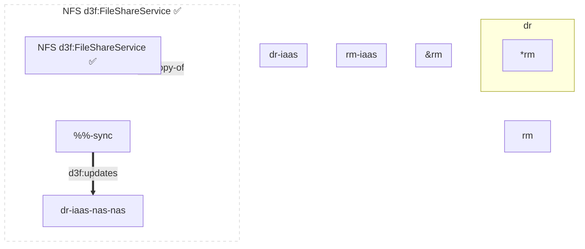
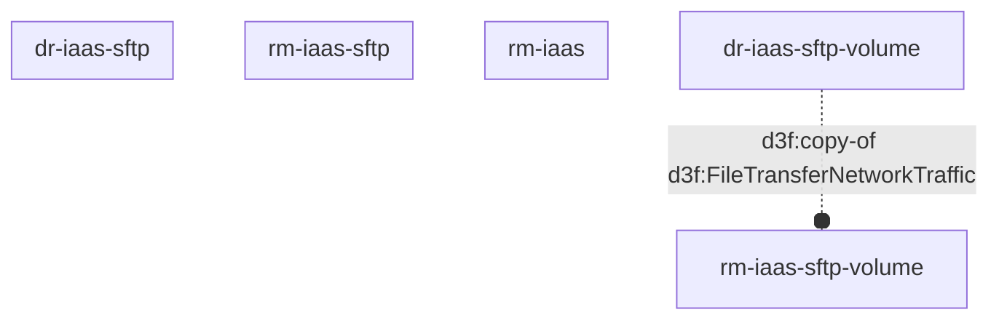
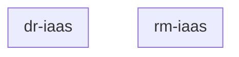
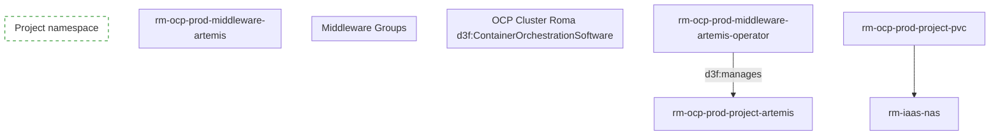
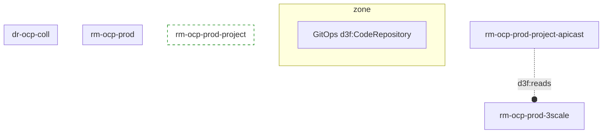
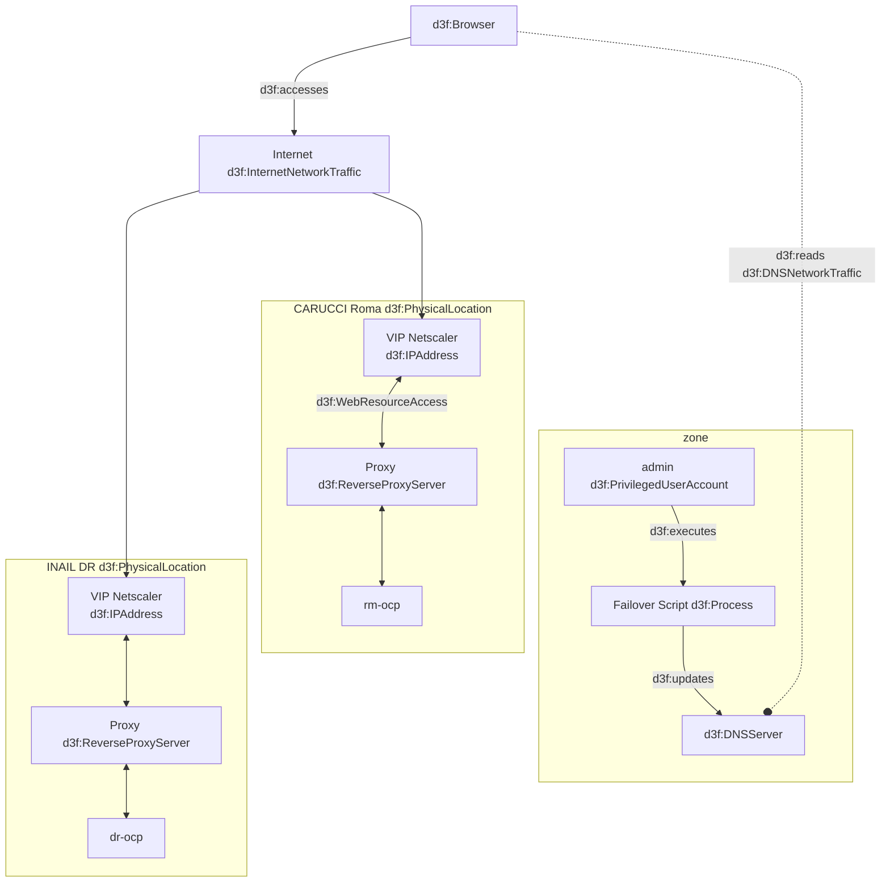
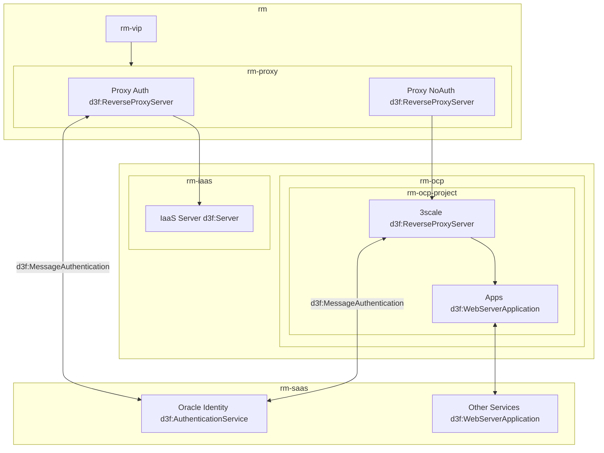

# Disaster Recovery

#### 3.3.6 Storage

#### NAS 

<!-- 🔴 ✅ -->

### SFTP  ✅ 

### Solr  🔴  

TBD

### ECS 🔴  

#### Artemis

Le applicazioni che usano Artemis vanno installate manualmente
sul DR.

- [ ] Le dir sono già in DR?
- [ ] Va approfondito il meccanismo di replica.

#### 3.3.3.3. Red Hat 3 Scale Api Gateway

In questa soluzione di disaster recovery, verranno implementati due api gateway indipendenti basati
su Red Hat 3scale, entrambi in esecuzione e installati in maniera simmetrica sui due cluster
OpenShift di Carucci e INAIL. Entrambi i gateway devono essere configurati allo stesso modo per
garantire una replica esatta delle stesse configurazioni. La configurazione speculare permette di
mantenere un’infrastruttura identica sui siti di Carucci e INAIL, riducendo le complessità delle
operazioni di failover.
Su ciascun data center verranno installati mediante operator sia la componente Admin Portal che
ApiCast, al fine di consentire un'operatività completa su entrambi i siti.
Le configurazioni applicative, costituite dalle definizioni di Product e Backend, verranno applicate su
entrambi i siti mediante CR dell’operator in maniera dichiarativa per mezzo di Openshift Gitops.

## 3.3.1.1. DNS e VIP
In questo contesto si dovranno configurare tutti gli indirizzamenti di rete utilizzando una
convenzione che consenta di mappare in maniera univoca gli indirizzi IP del sito di Carucci e i
rispettivi di INAIL. Ad esempio, così come fatto in occasione della predisposizione del DR di NoiPA,
rimappare la classe di indirizzi /16 10.100 sulla 10.101.
In caso di failover dal sito di Carucci a quello INAIL, si potrà provvedere tramite una procedura
automatizzata ad aggiornare massivamente i record DNS facendo puntare ai servizi esposti da
INAIL.

Q: dove risiedono i DNS?

## DNS

# Meet

- target 1: 5k user
- target 2: 2M user

NB: stabilire un modello di scale up, perché va fatto un redesign progressivo in funzione anche del carico (e..g, sanno che ci sarà un ramp-up progressivo che includerà anche key vault e cifratura dei dati, ecc..) che vanno progettati sin da ora.

- il doc RH è il punto di partenza.
- riusare le soluzioni di replica (e.g., )

in allegato il deck visto in call, a seguire le evidenze emerse:

nella progettazione tenere anche in considerazione gli aspetti di crittografia del database e del key vault, propedeutiche all’on-boarding in Cloudify delle Forze Armate;
Virtuoso non sarà oggetto di DR;
VMWare è utilizzato per PowerCenter, da tenere in considerazione nell’analisi;
LAND è già attivo active/active;
Il requisito è di DR e non BC, inoltre eventuali valutazioni di switch verso BC dovranno tenere conto delle mimiche applicative delle applicazioni Cloudify (es. esecuzione dei processi massivi);
Govway è già in DR;
OPI non è in ambito del DR Cloudify;
Submariner è da approfondire con Red Hat ed è da verificare se è licenziato. Inoltre, è necessario avere da parte dei gruppi applicativi le procedure di recovery dei processi che impattano i middleware Red Hat AMQ e Red Hat AMQ Stream;
La reingegnerizzazione delle pipeline verso ArgoCD terminerà orientativamente a fine luglio, pertanto, in una prima fase l’allineamento del software dovrà avvenire con le attuali pipeline DevOps;
valutare l’utilizzo di HSM come key vault;
valutare l’eventualità di effettuare stretching di VLAN anche per Cloudify;
verificare porting modulo OAM per gestione JWT.
 

Prossimi passi

Accenture condividerà una prima proposta (piano, attività, importo economico) tra venerdì 11 e lunedì 14. In particolare, dovranno essere considerate nel piano almeno 2 milestone, la prima a fine giugno, l’altra a chiusura attività
