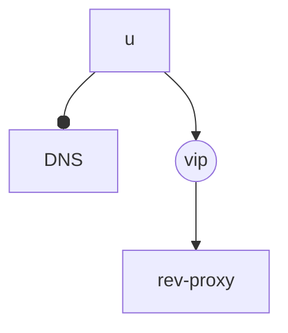
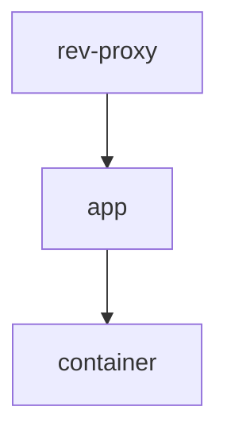
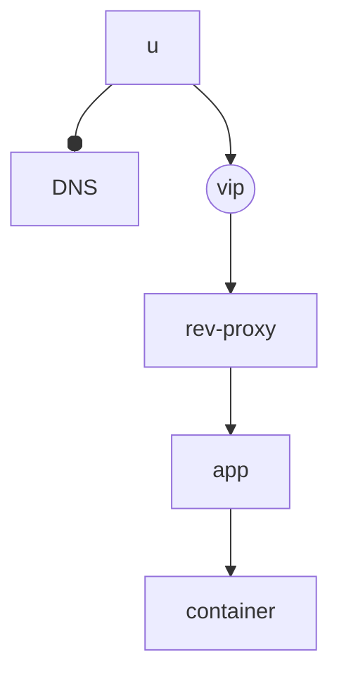

# a
## b

Bilanciamento

```mermaid

flowchart TD;

u --o DNS
u --> vip
vip((vip)) --> rev-proxy
```

Erogazione

```mermaid
flowchart TD;

rev-proxy --> app --> container
```

Completo

```mermaid
flowchart TD;

u --o DNS
u --> vip
vip((vip)) --> rev-proxy
rev-proxy --> app --> container
```