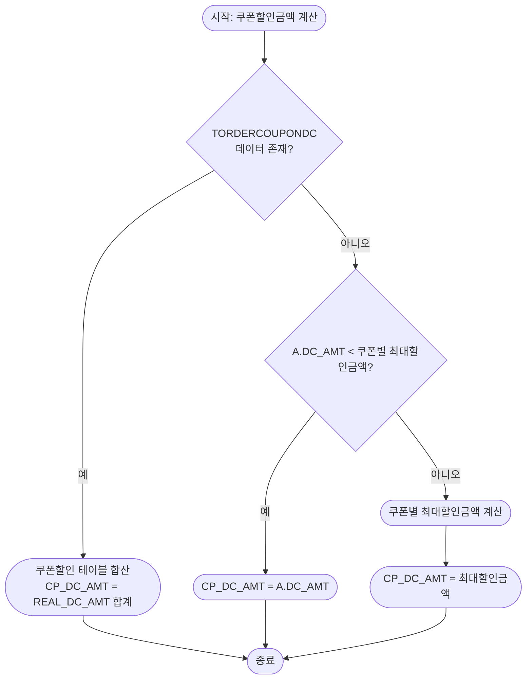

```mermaid
flowchart TD
    Start([시작: 쿠폰할인금액 계산])
    CouponDC{TORDERCOUPONDC<br>데이터 존재?}
    Start --> CouponDC
    CouponDC -- 예 --> SumCoupon([쿠폰할인 테이블 합산<br>CP_DC_AMT = REAL_DC_AMT 합계])
    CouponDC -- 아니오 --> DCAMTCompare{A.DC_AMT < 쿠폰별 최대할인금액?}
    SumCoupon --> End([종료])
    DCAMTCompare -- 예 --> SetCPDCAMT_DC_AMT([CP_DC_AMT = A.DC_AMT])
    DCAMTCompare -- 아니오 --> CalcMaxCoupon([쿠폰별 최대할인금액 계산])
    CalcMaxCoupon --> SetCPDCAMT_Max([CP_DC_AMT = 최대할인금액])
    SetCPDCAMT_DC_AMT --> End
    SetCPDCAMT_Max --> End
```
    